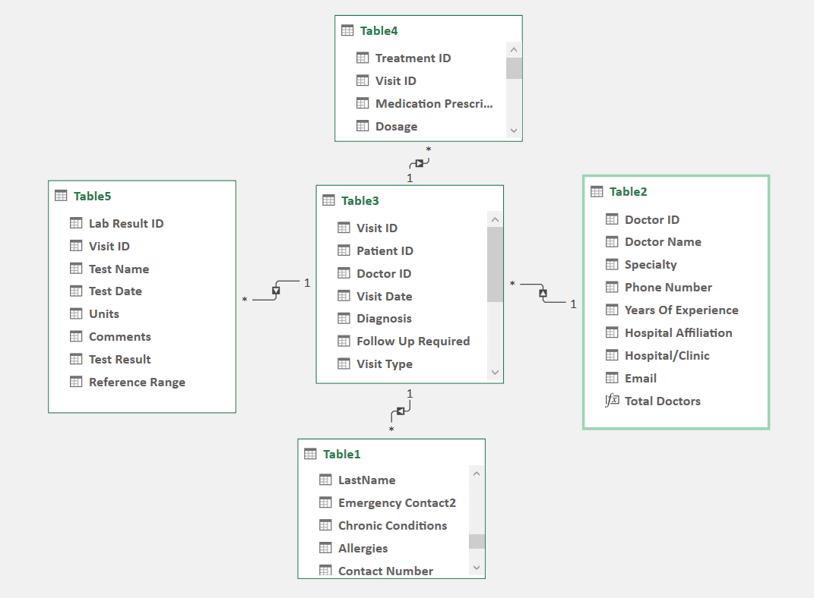

### Excel
To achieve the objectives of the Healthcare Data Analysis project, various advanced Excel functions were used, including:

#### Functions: VLOOKUP and XLOOKUP functions played a crucial role inorder to generate custom columns tailored to clinical project specifications.

#### Power Query Editor: Power Query Editor was used to streamline data processing, encompassing data cleaning and transformation.

#### Data Model Snapshot:

 

#### Power Pivot : Power Pivot was used to define relationships between tables, supporting the development of interactive and customizable PivotCharts.

#### Dashboard Snapshot:

 
