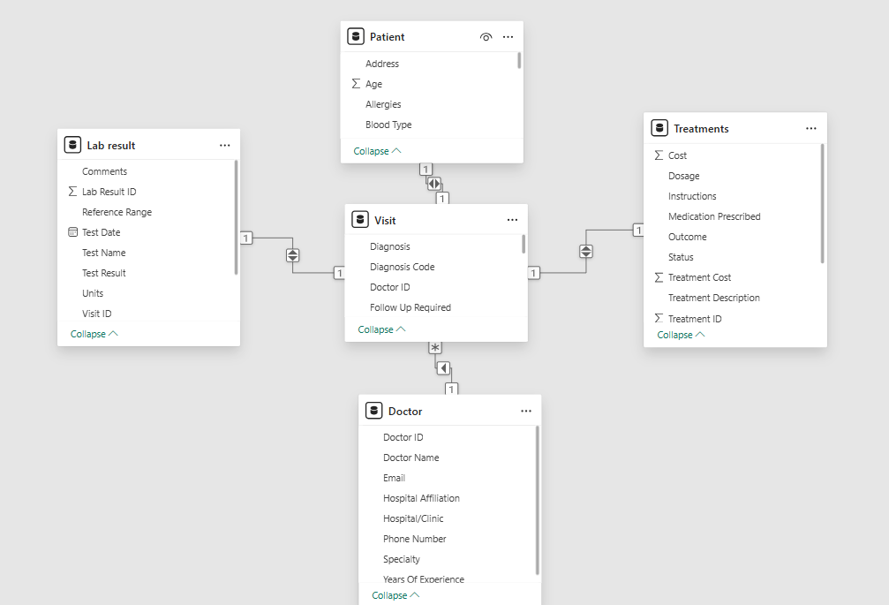
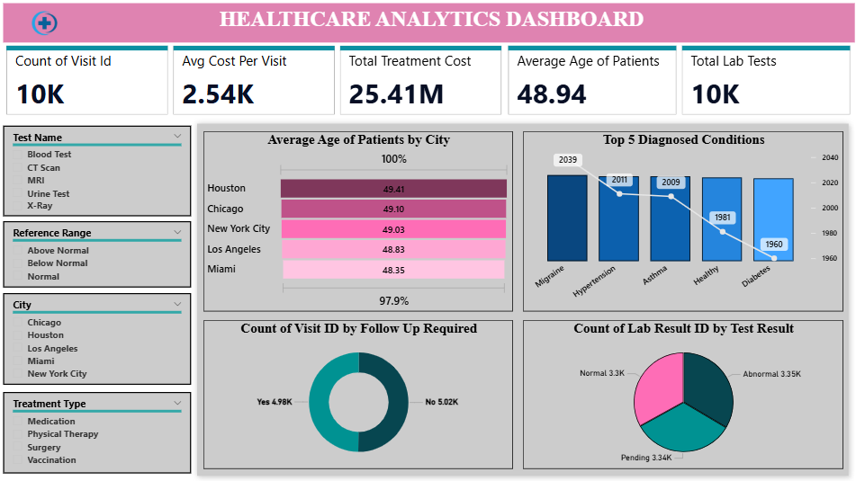

### Power Bi

To achieve the objectives of the Healthcare Data Analysis project, various Dax functions were used. Power Query Editor was used to Clean the Data and create new tables for interactive visuals

#### Model view snapshot:

 

#### Dashboard Snapshot:

 
