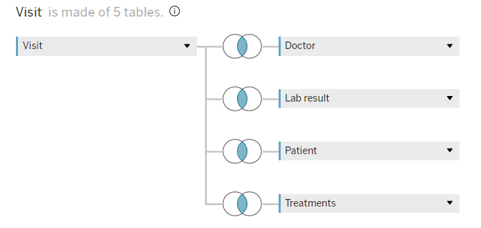
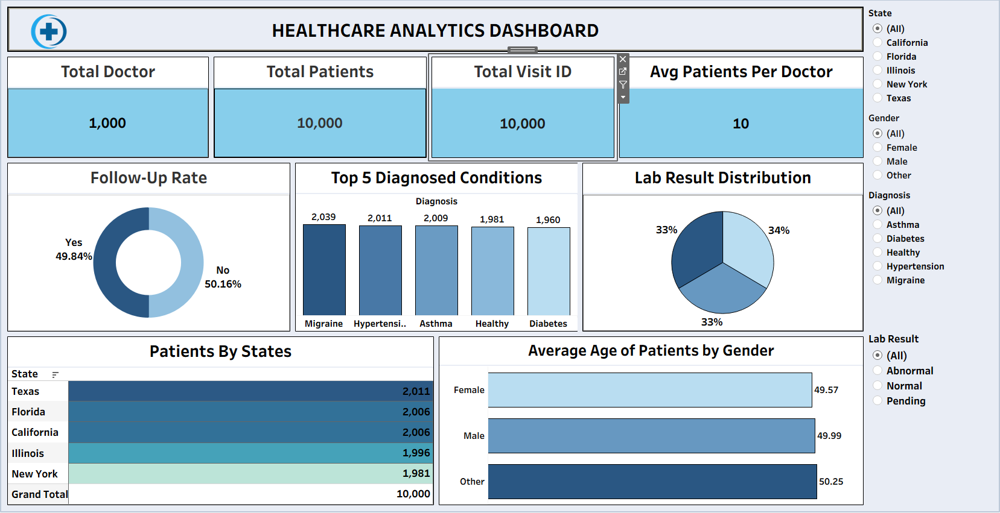

### Tableau
To achieve the objectives of the Healthcare Data Analysis project, Calculated fields were used to create columns for visualisation. We had to Create unions between the tables to the main table.

#### Union Snapshot:

 

#### Dashboard Snapshot:
 
